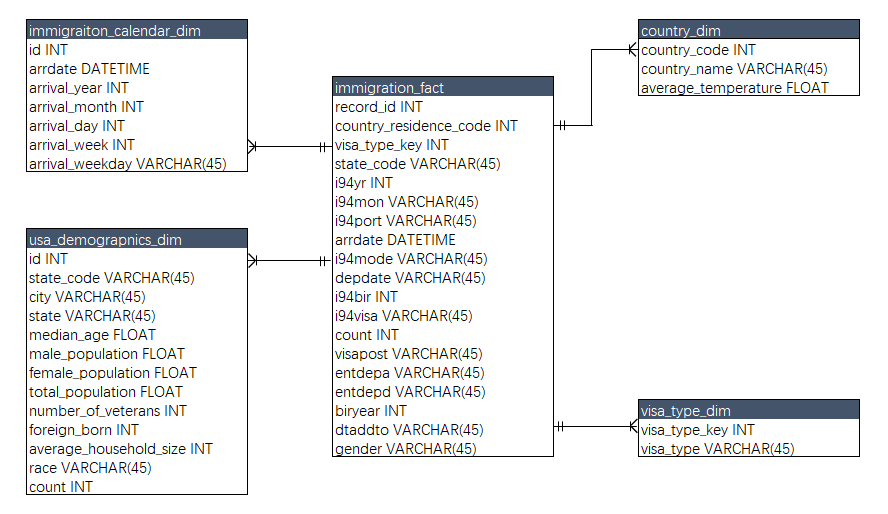

# Data Engineering Capstone Project

## Project Summary
The objective of this project was to create an ETL pipeline for I94 immigration, global land temperatures and US demographics datasets to form an analytics database on immigration events. A use case for this analytics database is to find immigration patterns to the US. 

## Data and Code
All the data for this project was loaded into S3 prior to commencing the project. The exception is the i94res.csv file which was loaded into Amazon EMR hdfs filesystem. 

In addition to the data files, the project workspace includes:
* **etl.py** - reads data from S3, processes that data using Spark, and writes processed data as a set of dimensional tables back to S3
* **etl_functions.py and utility.py** - these modules contains the functions for creating fact and dimension tables, data visualizations and cleaning. 
* **config.cfg** - contains configuration that allows the ETL pipeline to access AWS EMR cluster. 
* **Capstone Project Template.ipynb** - jupyter notebook that was used for building the ETL pipeline.

### The project follows the following steps:
* Step 1: Scope the Project and Gather Data
* Step 2: Explore and Assess the Data
* Step 3: Define the Data Model
* Step 4: Run ETL to Model the Data
* Step 5: Complete Project Write Up

## Step 1: Scope the Project and Gather Data
### Project Scope
To create the analytics database, the following steps will be carried out:
* Use Spark to load the data into dataframes.
* EDA of I94 immigration dataset to identify missing values and strategies for data cleaning.
* EDA of demographics dataset to identify missing values and strategies for data cleaning.
* EDA of global land temperatures by city dataset to identify missing values and strategies for data cleaning.
* Perform data cleaning functions on all the datasets.
* Create dimension tables.
    * Create immigration calendar dimension table from I94 immigration dataset, this table links to the fact table through the arrdate field.
    * Create country dimension table from the I94 immigration and the global temperatures dataset. The global land temperatures data was aggregated at country level. The table links to the fact table through the country of residence code allowing analysts to understand correlation between country of residence climate and immigration to US states. 
    * Create usa demographics dimension table from the us cities demographics data. This table links to the fact table through the state code field. 
    
* Create fact table from the clean I94 immigration dataset and the visa_type dimension.

The technology used in this project is **Amazon S3, Apache Spark**. Data will be read and staged from the customers repository using Spark.
## Step 2: Explore and Assess the Data
> Refer to the jupyter notebook for exploratory data analysis

## Step 3: Define the Data Model
### 3.1 Conceptual Data Model

`country dimension table`:   
It's made up of data from the global land temperatures by city and the immigration datasets.    
The combination of these two datasets allows analysts to study correlations between global land temperatures and immigration patterns to the US.

`us demographics dimension table`:   
It comes from the demographics dataset and links to the immigration fact table at US state level. This dimension would allow analysts to get insights into **migration patterns** into the US based on demographics as 

`visa type dimension table`:   
It comes from the immigration datasets and links to the immigaration via the visa_type_key. 

`immigration fact table`:   
It is the heart of the data model. This table's data comes from the immigration data sets and contains keys that links to the dimension tables. The data dictionary of the immigration dataset contains detailed information on the data that makes up the fact table. 

### 3.2 Mapping Out Data Pipelines
The pipeline steps are as follows:
* Load the datasets
* Clean the I94 Immigration data to create Spark dataframe for each month
* Create visa_type dimension table
* Create calendar dimension table
* Extract clean global temperatures data
* Create country dimension table
* Create immigration fact table
* Load demographics data
* Clean demographics data
* Create demographic dimension table

## Step 4: Run Pipelines to Model the Data 
### 4.1 Create the data model
> Refere to the jupyter notebook for the data dictionary.

### 4.2 Running the ETL pipeline
The ETL pipeline is defined in the etl.py script, and this script uses the utility.py and etl_functions.py modules to create a pipeline that creates final tables in Amazon S3.

## Step 5: Complete Project Write Up
* Rationale for the choice of tools and technologies for the project:
    * Apache spark was used because of:
        * Support mainstream languages, such as python, which is popular.
        * Ability to handle multiple file formats with large amounts of data. 
        * Apache Spark offers a lightning-fast unified analytics engine for big data.
        * Spark has easy-to-use APIs for operating on large datasets.Spark provides more operators to make the operation more convenient.
* Propose how often the data should be updated and why:
    * monthly: The current I94 immigration data is updated monthly, and hence the data will be updated monthly. 
* Write a description of how you would approach the problem differently under the following scenarios:
 * The data was increased by 100x.
     * Spark can handle the increase but we would consider increasing the number of nodes in our cluster.
     * With the development of the times, new hardware will appear. We can upgrade the hardware and improve the performance of single machine.
 * The data populates a dashboard that must be updated on a daily basis by 7am every day.
     * In this scenario, Apache Airflow will be used. 
     * We can schedule and run data pipelines to create, monitor, and tune data.
 * The database needed to be accessed by 100+ people.
     * In this scenario, we would move our analytics database into Amazon Redshift. 
     * We can assign different permissions to different people.
     * Potential for using elastic resources, we need to think of a scenario for 1000 people in advance.